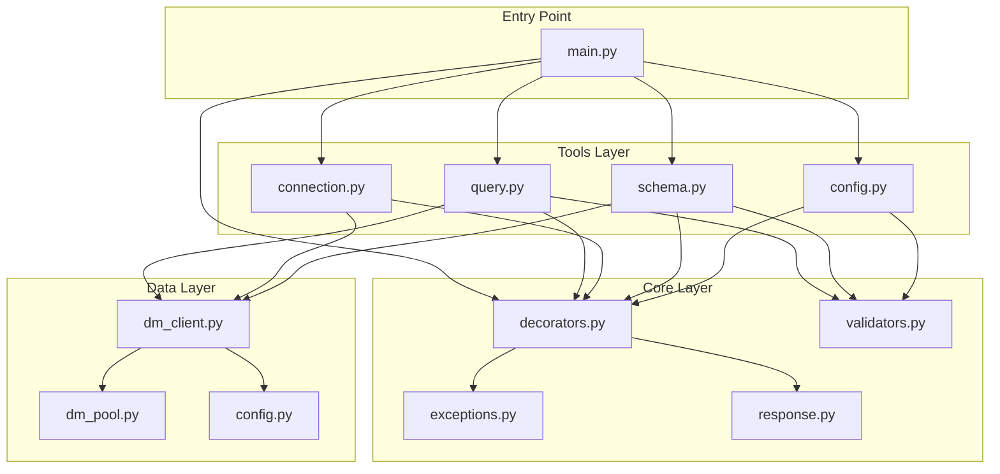

# Design Document

## Overview

本设计文档描述了达梦数据库 MCP 服务器的代码重构方案。通过引入装饰器模式、模块化拆分和集中化的错误处理，将 `main.py` 从 800+ 行精简到约 100 行，同时提高代码的可维护性和可扩展性。

## Architecture

重构后的项目结构：

```
dm-mcp/
├── main.py                    # 入口文件，MCP 服务器初始化和工具注册（~100行）
├── dm_client.py               # 数据库客户端（保持不变）
├── dm_pool.py                 # 连接池（保持不变）
├── config.py                  # 配置管理（保持不变）
├── dm_config.json             # 配置文件（保持不变）
├── core/                      # 核心模块
│   ├── __init__.py
│   ├── exceptions.py          # 自定义异常类
│   ├── decorators.py          # 工具处理装饰器
│   ├── validators.py          # 输入验证器
│   └── response.py            # 响应构建器
└── tools/                     # MCP 工具模块
    ├── __init__.py            # 工具注册
    ├── query.py               # 查询工具 (dm_query)
    ├── connection.py          # 连接工具 (dm_connect)
    ├── schema.py              # 模式工具 (dm_list_tables, dm_list_views, dm_describe_table, dm_get_view_definition)
    └── config.py              # 配置工具 (dm_update_config)
```



## Components and Interfaces

### 1. core/exceptions.py

自定义异常类模块：

```python
class DMMCPError(Exception):
    """达梦数据库 MCP 操作的基础异常类"""
    pass

class DatabaseConnectionError(DMMCPError):
    """数据库连接失败时抛出的异常"""
    pass

class InvalidParameterError(DMMCPError):
    """输入参数无效时抛出的异常"""
    pass

class SQLExecutionError(DMMCPError):
    """SQL 执行失败时抛出的异常"""
    pass
```

### 2. core/response.py

响应构建器模块：

```python
def create_response_metadata(
    operation: str,
    success: bool,
    execution_time: float = 0.0,
    row_count: int = None,
    additional_info: Dict[str, Any] = None
) -> Dict[str, Any]:
    """创建标准化的响应元数据"""
    pass

def create_success_response(
    operation: str,
    data: Any,
    execution_time: float,
    **extra_fields
) -> Dict[str, Any]:
    """创建成功响应"""
    pass

def create_error_response(
    operation: str,
    error: Exception,
    error_type: str,
    execution_time: float,
    **extra_fields
) -> Dict[str, Any]:
    """创建错误响应"""
    pass
```

### 3. core/decorators.py

工具处理装饰器模块：

```python
# 错误类型映射
ERROR_TYPE_MAP = {
    InvalidParameterError: "validation_error",
    DatabaseConnectionError: "connection_error",
    SQLExecutionError: "sql_error",
    TimeoutError: "pool_timeout_error",
}

def mcp_tool_handler(operation_name: str, **response_fields):
    """
    MCP 工具处理装饰器
    
    功能：
    - 自动计时
    - 统一错误处理
    - 标准化响应格式
    
    Args:
        operation_name: 操作名称，用于元数据
        **response_fields: 额外的响应字段名（从函数参数中提取）
    """
    pass
```

### 4. core/validators.py

输入验证器模块：

```python
def validate_identifier(identifier: str, identifier_type: str = "identifier") -> str:
    """验证数据库标识符（表名、模式名等）"""
    pass

def validate_sql_query(sql: str) -> str:
    """验证 SQL 查询的安全性"""
    pass

def validate_optional_schema(schema: str) -> Optional[str]:
    """验证可选的 schema 参数"""
    pass
```

### 5. tools/ 模块

每个工具模块导出工具函数，由 `tools/__init__.py` 统一注册：

```python
# tools/__init__.py
from .query import dm_query
from .connection import dm_connect
from .schema import dm_list_tables, dm_list_views, dm_describe_table, dm_get_view_definition
from .config import dm_update_config

def register_tools(mcp):
    """注册所有工具到 MCP 服务器"""
    mcp.tool()(dm_query)
    mcp.tool()(dm_connect)
    mcp.tool()(dm_list_tables)
    mcp.tool()(dm_list_views)
    mcp.tool()(dm_describe_table)
    mcp.tool()(dm_get_view_definition)
    mcp.tool()(dm_update_config)
```

## Data Models

### 响应格式

成功响应：
```python
{
    "success": True,
    "data": [...],  # 或其他字段如 message, test_query_result
    "metadata": {
        "timestamp": 1234567890.123,
        "operation": "dm_query",
        "success": True,
        "execution_time_seconds": 0.1234,
        "row_count": 10,
        # 其他附加信息
    }
}
```

错误响应：
```python
{
    "success": False,
    "error": "错误描述",
    "metadata": {
        "timestamp": 1234567890.123,
        "operation": "dm_query",
        "success": False,
        "execution_time_seconds": 0.0123,
        "error_type": "validation_error"
    }
}
```

## Correctness Properties

*A property is a characteristic or behavior that should hold true across all valid executions of a system-essentially, a formal statement about what the system should do. Properties serve as the bridge between human-readable specifications and machine-verifiable correctness guarantees.*


Based on the prework analysis, the following properties are identified:

**Property Reflection:**
- Properties 2.1, 2.2 can be combined: both test that execution timing is recorded
- Properties 2.3, 2.4 can be combined: both test response format standardization
- Properties 1.2-1.5 are specific examples of error type mapping, covered by 1.1
- Properties 3.1, 3.2, 3.3 can be combined into validator correctness
- Properties 5.1, 5.3 can be combined into backward compatibility

### Property 1: Decorator catches all exceptions and returns standardized response

*For any* tool function decorated with `mcp_tool_handler` and *for any* exception raised by that function, the decorator SHALL catch the exception and return a dict containing `success=False`, `error` (string), and `metadata` (dict with `error_type`).

**Validates: Requirements 1.1, 1.2, 1.3, 1.4, 1.5**

### Property 2: Decorator records execution time and formats response

*For any* tool function decorated with `mcp_tool_handler`, whether it succeeds or fails, the returned response SHALL contain `metadata.execution_time_seconds` as a non-negative float, and `metadata.success` matching the top-level `success` field.

**Validates: Requirements 2.1, 2.2, 2.3, 2.4**

### Property 3: Validator rejects invalid identifiers

*For any* string containing SQL injection patterns (`;`, `'`, `"`, `--`, `/*`), SQL keywords (`DROP`, `DELETE`, `INSERT`, etc.), or invalid characters, the `validate_identifier` function SHALL raise `InvalidParameterError`.

**Validates: Requirements 3.1, 3.3**

### Property 4: Validator rejects non-SELECT queries

*For any* SQL string that does not start with SELECT or contains dangerous keywords (`DROP`, `DELETE`, `UPDATE`, `INSERT`, `CREATE`, `ALTER`, `EXEC`, `TRUNCATE`, `MERGE`, `GRANT`, `REVOKE`), the `validate_sql_query` function SHALL raise `InvalidParameterError`.

**Validates: Requirements 3.2, 3.3**

### Property 5: Response format backward compatibility

*For any* tool function call with valid parameters, the response structure SHALL contain the same top-level keys and metadata structure as the original implementation (success, data/error, metadata with timestamp, operation, success, execution_time_seconds).

**Validates: Requirements 5.1, 5.3**

## Error Handling

错误处理通过装饰器统一实现：

1. **错误类型映射**：
   - `InvalidParameterError` → `"validation_error"`
   - `DatabaseConnectionError` → `"connection_error"`
   - `SQLExecutionError` → `"sql_error"`
   - `TimeoutError` → `"pool_timeout_error"`
   - `RuntimeError`（包含"连接池"或"pool"）→ `"pool_error"`
   - 其他 `Exception` → `"unexpected_error"`

2. **超时错误特殊处理**：
   - 检查错误消息中是否包含"超时"或"timeout"
   - 如果是，设置 `error_type` 为 `"timeout_error"`

3. **错误消息格式化**：
   - 验证错误：`"无效的 SQL 查询: {message}"`
   - 连接错误：直接使用异常消息
   - 超时错误：`"查询超时: {message}"` 或 `"获取数据库连接超时: {message}"`
   - 意外错误：`"查询执行过程中发生意外错误: {message}"`

## Testing Strategy

### 单元测试

使用 pytest 进行单元测试：

1. **core/exceptions.py 测试**：
   - 验证异常类继承关系
   - 验证异常可以正确实例化和抛出

2. **core/validators.py 测试**：
   - 测试有效标识符通过验证
   - 测试各种无效标识符被拒绝
   - 测试 SQL 注入模式被检测
   - 测试 SELECT 查询通过验证
   - 测试危险 SQL 关键字被拒绝

3. **core/response.py 测试**：
   - 测试成功响应格式
   - 测试错误响应格式
   - 测试元数据包含所有必需字段

4. **core/decorators.py 测试**：
   - 测试装饰器正确包装函数
   - 测试成功执行返回正确格式
   - 测试异常被正确捕获和转换

### 属性测试

使用 hypothesis 库进行属性测试：

1. **Property 1 测试**：生成随机异常，验证装饰器返回标准化响应
2. **Property 2 测试**：生成随机函数执行，验证计时和响应格式
3. **Property 3 测试**：生成包含危险字符的字符串，验证验证器拒绝
4. **Property 4 测试**：生成非 SELECT SQL，验证验证器拒绝
5. **Property 5 测试**：对比重构前后的响应格式

每个属性测试配置运行 100 次迭代。
